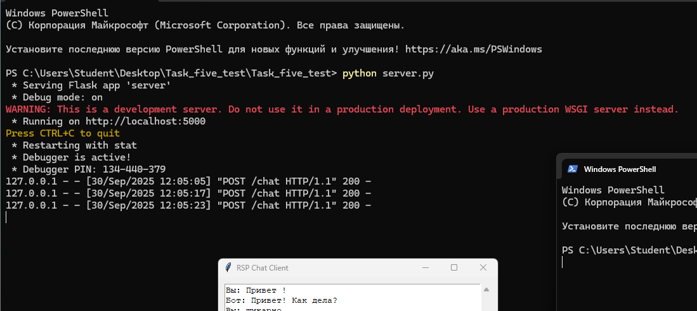
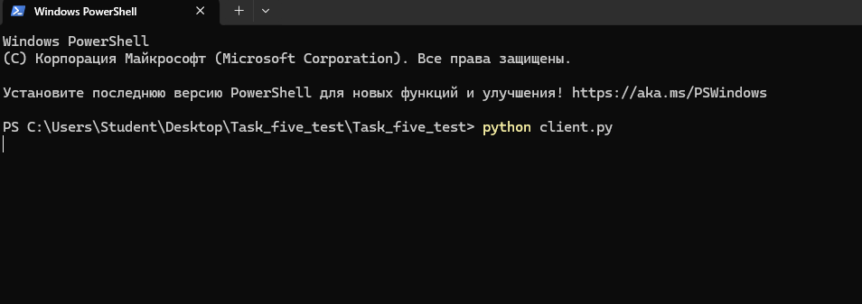
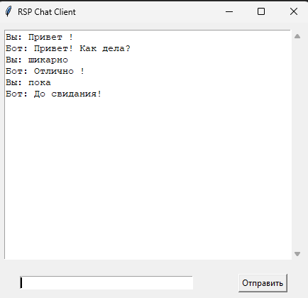

# Task_five_test
ради интереса по заданию 5 

задание звучало так : 
развернуть локально сервер и создать простой чатик ( вопрос -> ответ ) с визуальным интерфейсом ( через tkinter или PyQt)

# скрины с запуском :
**запуск локального сервера** 

**запуск самого чатика**

**визуал приложения**
